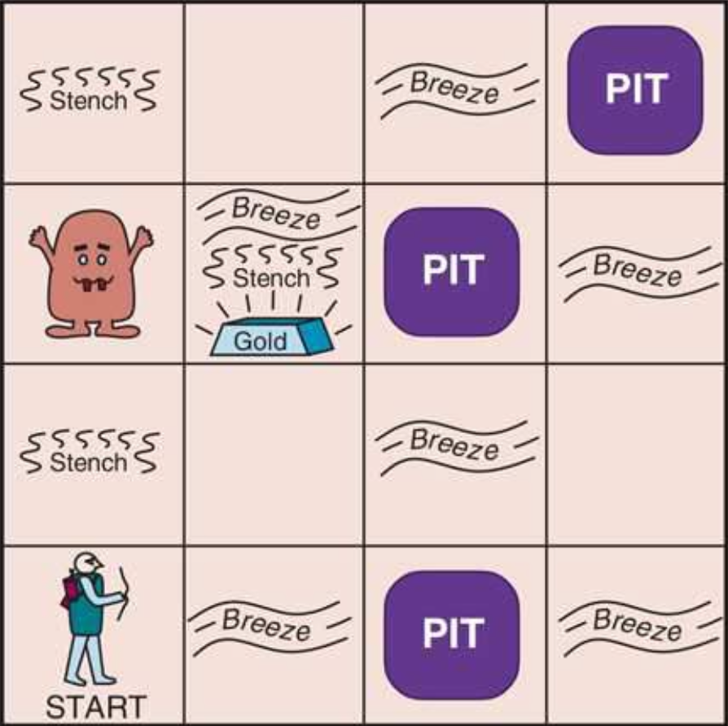

[](https://github.com/unprosaiclabyrinth/Theseus/releases)

<p align="center">
  
</p>

# Agent Architectures

This project implements different intelligent agent architectures for an agent called `Theseus` that operates in the wumpus world (described in AIMA 4ed with slight variations). The architectures are implemented with the *a priori* knowledge that:

+ The agent starts in (1,1), facing east, in a $$4 \times 4$$ grid.
+ There are exactly two pits in the world.
+ The *forward probability* of the `GO_FORWARD` action can be passed in using the `-n` flag (look at the `run` recipe in the Makefile). For example, a forward probability of 0.8 implies that on a `GO_FORWARD` action, the agent has an 80% chance of going forward, and a 10% chance each of slipping to the right or the left while keeping its orientation unchanged. All other actions are always deterministic. A forward probability of 1 means that the agent is deterministic.
+ `NO_OP` is a possible action that does nothing. It has no cost, unlike other actions.

Theseus compares five agent architectures on a partially observable task. Each agent receives percepts and chooses actions to maximize average simulator score: collect gold, avoid hazards, and account for movement and shooting costs. The architectures differ in how they use memory, a world model, planning, and learning. They are educational implementations, not guaranteed optimal policies.

1. **Simple reflex agent (SRA):** Chooses the next action based solely on the current percept and condition-action rules; stores no internal state, has no memory of past actions/observations, performs no lookahead.

2. **Model-based reflex agent (MRA):** Maintains a world model that represents the agent's state of knowledge about the world, which is used in conjunction with the observation at every time step to compute the action according to condition-action rules. The world model is updated according to the action that is executed and the observation.

3. **Utility-based agent (UBA):** Uses POMCP-style Monte Carlo tree search with root sampling from exact finite belief support, deterministic simulation, macro-actions, configurable rollout policies, and optional reward/tree-policy biases. See [planner design and experiments](docs/PLANNER.md).

4. **Reactive Learning Agent (RLA):**  Operates in an **unknown** environment, in which the forward probability (the probability with which the agent goes forward on a `GO_FORWARD` action as opposed to slipping to the left or the right) is unknown. A forward probability of 1 means that the environment is completely deterministic. The forward probability is one of three values: 1, 0.8, or $$\frac{1}{3}$$, but the RLA doesn't know which *a priori*. The RLA spends some time collecting data through experience, from which it learns the forward probability using maximum likelihood estimation (MLE). This is the exploration phase. Once the forward probability is learnt, the RLA switches to the exploitation phase, where it uses the learnt forward probability along with the known transition model to navigate the environment and maximize its score.

5. **LLM-Based Agent (LBA):** Defers the entire decision-making process to an LLM&mdash;a configurable Google Gemini model. At each step, the accumulated percept history is encoded into a natural-language prompt, which is then submitted to the model along with a JSON specification defining a rough layout for the response.

# Getting Started

Requires a full **JDK 21 or newer** and **Scala CLI** (the modern `scala` command).
Tests and benchmark scripts also require **Python 3.10 or newer**; they use only the standard library.
Scala and Java both target Java 21 APIs and bytecode, even when built with a newer JDK.
The compiler is pinned to Scala 3.8.3 in `project.scala`. Install Scala CLI from
[its installation guide](https://scala-cli.virtuslab.org/install/) and a JDK before running:

```sh
git clone https://github.com/unprosaiclabyrinth/Theseus.git
cd Theseus
make check
make build
make test
make lint
make mra
```

The build works with POSIX shells on macOS and Linux. It compiles Scala and Java
explicitly, with no background build server. Dependencies are downloaded from
Maven Central on the first build. No precompiled application JAR is required.
`project.scala` declares the JSON library and compiler versions.

Agent targets are `sra`, `mra`, `uba`, `rla-deterministic`, `rla-biased`,
`rla-uniform`, and `lba`. `make run` uses UBA. Selecting an agent never edits
source files or creates backups. To choose runtime settings:

```sh
./scripts/run.sh --help
./scripts/run.sh --agent mra -t 100 -r 42 --quiet -f mra-results.txt
./scripts/run.sh --agent rla -n 0.8 -t 100 -r 42 --quiet -f rla-results.txt
```

Options:

| Option | Meaning |
| --- | --- |
| `--agent` | `sra`, `mra`, `uba`, `rla`, or `lba`; default `uba` |
| `-t` | Positive number of trials; default 1 |
| `-s` | Positive maximum number of steps per trial; default 50 |
| `-r` | Integer random seed; generated and printed if omitted |
| `-n` | Finite forward probability in [0,1]; default 1 |
| `-f` | Trace/summary filename; default `wumpus_out.txt` |
| `--scores` | Score CSV filename; default `<trace filename>.scores.csv` |
| `--quiet` | Omit step traces and agent chatter; retain summary and scores |
| `--mixed` | Cycle RLA trials through probabilities 1, 0.8, and 1/3 |

UBA also accepts `--simulations`, `--horizon`, `--discount`, `--exploration`,
`--tree-policy`, `--rollout`, and `--shaping`. Defaults and semantics are in the
[planner guide](docs/PLANNER.md).

Bundled agents assume a 4x4 world and a fixed start at (1,1), facing east.
Unsupported dimensions or random starting locations are rejected. MRA and UBA
require deterministic movement. RLA supports 1, 0.8, and approximately 1/3.

Output files are overwritten when a run starts. Use distinct filenames for
results you want to keep or for concurrent runs. Failed trials are not included
as successful scores; failures return a nonzero exit status. Completed score
rows are flushed after each trial. Agent state is reset before and after each
trial. Concurrent simulations inside one JVM are unsupported because the
educational agent implementations use singleton state.

## LLM agent

```sh
export GOOGLE_API_KEY='your-key'
# Optional; choose a Gemini model available to your account:
export GOOGLE_MODEL='gemini-2.5-flash'
make lba
```

The LLM agent sends game observations and executed actions to Google's
[Gemini API](https://ai.google.dev/gemini-api/docs/openai). Calls may incur API
charges. The key is sent in an HTTPS authorization header, not in a URL or shell
command. The client is included as source, limits each request to 30 seconds,
spaces requests by at least four seconds, and accepts only six exact action
names from validated JSON. API or response errors fail the run with a nonzero
status. Shutdown closes the client without making additional requests.

The default model is configurable because model availability changes. Offline
regression tests exercise parsing and request timing without using credentials
or making paid requests. The historical Gemini 2.0 client JAR has been removed.

## Custom agents

Implement `AgentFunctionImpl` with `process(TransferPercept): Int` and `reset(): Unit`.
Register the implementation in `AgentFunction` and its name in the CLI validator,
or pass `new AgentFunction(name, implementation)` directly to `Simulation`.
Return one of the `Action` constants. `END_TRIAL` stops the trial without cost;
unknown action values fail the run. `reset()` must clear all trial-local state.
There are no required source comments, line numbers, or backup-file protocols.

# Design and Evaluation

The `reports/` PDFs and `scores/` files are **historical results for the original
Spring 2025 implementation**. They are preserved unchanged and do not describe
all subsequent correctness fixes. In particular, old scores must not be treated
as benchmarks for the corrected planner, learner, or LLM client.

```sh
make tenk       # 10,000 UBA trials
make la-tenk    # 10,000 RLA trials split across the three environments
```

The mixed run records every trial in one CSV, including seed, agent, movement
probability, score, outcome counts and decision timing. It produces one weighted overall mean and does not
replace earlier probability groups' scores. For comparable experiments, use
explicit seeds, identical world settings and step limits, and record the source
revision. The seed controls world generation, stochastic movement, and agent
sampling. Reproducibility assumes the same compiler/runtime and algorithm;
remote LLM responses are not deterministic.

For repeatable policy comparisons and parameter sweeps, use
`scripts/benchmark.py`; see the [experiment guide](docs/PLANNER.md#experiments).
`make format` applies pinned Scalafmt; `make lint` checks formatting, shell syntax,
Python syntax and whitespace. CI runs lint and tests on JDK 21, macOS and Linux.

The UBA's search is expensive: use small trial counts first. Its simulator now
terminates at successful grabs and deaths, and real actions are selected by
estimated value rather than a search exploration bonus. The MRA treats only
logically certain hazards as permanent facts. The RLA uses a discrete maximum
likelihood estimate over its supported probabilities; finite samples can still
misidentify the environment. If later observations contradict its belief, the RLA
switches to cautious reflex actions instead of choosing from an impossible model.

The repository remains an educational implementation. There is no claim of
optimal policy performance or a completed security audit. No license has been
added: the inherited simulator's attribution remains intact, and redistribution
terms need to be established by the repository owner.
