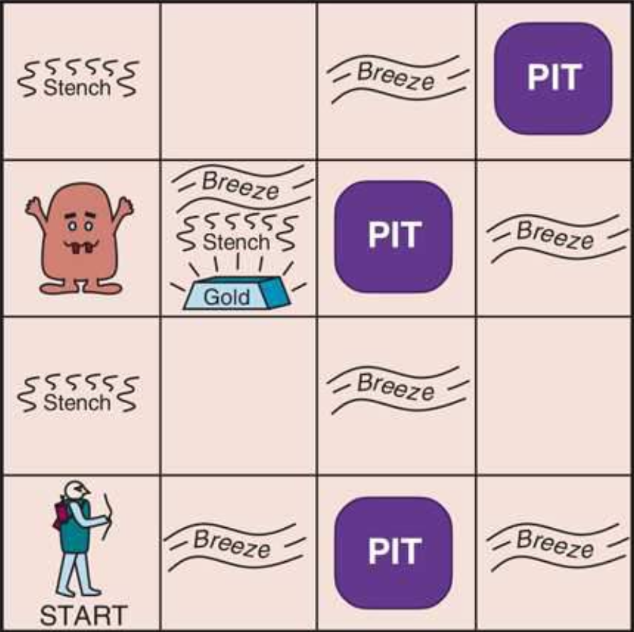

<p align="center">
  
</p>

This project implements different intelligent agent architectures for an agent called `Theseus511` that operates in the wumpus world (described in AIMA 4ed with slight variations). The architectures are implemented with the *a priori* knowledge that:-

+ The agent starts in (1,1), facing east, in a $$4 \times 4$$ grid.
+ There are exactly two pits in the world.
+ The *forward probability* of the `GO_FORWARD` action can be passed in using the `-n` flag (look at the `run` recipe in the Makefile). For example, a forward probability of 0.8 implies that on a `GO_FORWARD` action, the agent has an 80% chance of going forward, and a 10% chance each of slipping to the right or the left while keeping its orientation intact. All other actions are always deterministic. A forward probability of 1 means that the agent is determinisitic.
+ A `NO_OP` is a possible action that does nothing. It has no cost, unlike other actions.

The agent aims to maximize the **average** score. The different architectures the project implements are:-

1. Simple reflex agent (SRA)
2. Model-based reflex agent (MRA) 
3. Utility-based agent (UBA)
4. Hybrid Learning Agent (HLA)

# Getting Started

All agent architectures are implemented in Scala. The `src` directory contains the source code for the wumpus world simulator and the agent implementation. The project repo contains a Makefile that automates building and running the different agents. The Makefile runs the project with the options `forwardProbability (-n)` set to 1 and `randomAgentLoc (-r)` set to `false`. It contains a `check` target that checks the system for the necessary tools (`scala`, `java`). It is recommended that the system is checked for the necessary tools before running the project. The check command is:-
```zsh
make check
```
The simple reflex agent can be run using:-
```zsh
make sra
```
The model-based reflex agent can be run using:-
```zsh
make mra
```
The utility-based agent can be run using:-
```zsh
make uba
```
The hybrid learning agent can be run using:-
```zsh
make hla
```
The current implementation of the agent function or a custom implementation (**note: if [proper protocol](#proper-protocol-for-custom-implementations) or formatting is not followed, or the custom AgentFunction results in an error, the custom run could lead to junk backup files in the `src/java` directory, or could break the `sra`, `mra`, `uba`, and `hla` targets altogether**) can be run using:-
```zsh
make run
```
The project was tested using:-

+ **Scala Version:** 3.6.3
+ **Java Version:** OpenJDK 22.0.1

## Proper protocol for custom implementations

1. Implement the custom agent in a `src/scala/CustomAgent.scala` object that extends the `AgentFunctionImpl` trait.
2. Override and define the abstract `process` method such that it returns the actions given the percepts. Replace the "specify agent" line (line 21) in `src/java/AgentFunction.java` with:-
```java
return CustomAgent.process(tp) // specify agent
```
3. Make sure that you have copied the comment verbatim and have ended the line with it.
4. Make sure to override and define the `reset` method for your agent and reset it if necessary in WorldApplication.java just under line 162.
4. Run `make run` to run the agent. This will not break the `sra`, `mra`, `uba`, and `hla` targets.

# Design

The `reports` directory contains documents detailing the agent designs.

# Evaluation

The agent architectures are generally evaluated on their average score after 10,000 runs. The `scores` directory contains the score lists for 10,000 runs for all agents, whose summary statistics are provided in the respective reports. The 10,000 trials can be run using:-
```zsh
make tenk
```
**Note that the above command runs 10,000 trials for the *current* implementation.** Feel free to run your own trials. Of course, the `run` recipe can be updated with the `-t` option for multiple trials. Since 10,000 is a common number of trials for evaluation, a separate `make` target called `tenk` is provided that runs 10,000 trials of the current agent implementation. The score for each trial and the average score is written to "wumpus_out.txt" or to the output file you specify using the `-f` option in the recipe.

A sample evaluation target is separately provided for learning agent architectures that have to learn the forward probability from an *a priori* unknown environment. It runs the *current* implementation for 3,334 trials with a forward probability of 1, 3,333 trials with a forward probability of 0.8, and 3,333 trials with a forward probability of 0.3334, making a total of 10,000 trials. It can be run using:-
```zsh
make la-tenk
```
As before, the score for each trial and the average score is written to "wumpus_out.txt" or to the output file you specify using the `-f` option in the recipe.
